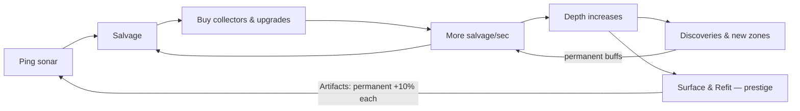

# Fathom — Game Scope (v1)

> **Working title.** A deep-sea idle game for the browser: send drones into the abyss, salvage what they find, and see how deep you can go.

## The pitch

You run a tiny deep-sea salvage outfit. You start by pinging sonar yourself for scraps, then buy divers, drones, and submersibles that collect salvage automatically. As your operation grows, your fleet reaches ever greater **depth** — and depth is where the fun lives: every few hundred meters you discover something (a kelp forest, a shipwreck, an anglerfish, hydrothermal vents), each with a permanent bonus and an entry in your discovery log. The screen literally darkens as you descend from sunlit water toward the abyss.

When you stall out, you **Surface & Refit**: reset your run in exchange for Artifacts that permanently boost everything, and dive again — faster, deeper. The long game: reach the bottom of Challenger Deep at 10,935m.

## Why this shape

This maps directly to the scoping answers:

- **Idle game** → the core is an economy: generators, upgrades, and a prestige loop. The genre's fun comes from growth you can feel, meaningful "what do I buy next" choices, and a steady drip of new things appearing.
- **Browser** → plain HTML/CSS/JS, no installs, hosted free on GitHub Pages. Anyone with the link can play.
- **Enjoyable to play** → the depth/discovery system is the hook that generic clickers lack: there's always a *next thing to see*, not just a next number. Plus the retention essentials: offline progress ("While you were away…"), satisfying number formatting, and no grind walls in the first hour.
- **Weekend-size** → hard content caps: 6 generators, ~8 upgrades, ~12 discoveries, 1 prestige layer. Everything else is stretch.

## Core loop



## MVP feature spec

### 1. Salvage & collectors

One currency: **Salvage**. Click "Ping Sonar" for +1 (upgradable). Six collector tiers, each producing salvage per second. Costs grow ×1.15 per unit owned — the standard idle curve, proven to pace well:

| Collector | Base cost | Salvage/sec |
|---|---|---|
| Diver | 15 | 0.1 |
| ROV Drone | 100 | 1 |
| Submersible | 1,100 | 8 |
| Deep Station | 12,000 | 47 |
| Abyssal Trawler | 130,000 | 260 |
| Leviathan Tamer | 1,400,000 | 1,400 |

### 2. Upgrades

One-off purchases that multiply things. Starting set of eight (more are cheap to add — each is one row in a data table):

| Upgrade | Cost | Effect |
|---|---|---|
| Reinforced Nets | 500 | Divers ×2 |
| Sonar Array | 2,000 | Clicks +9 |
| Fiber-Optic Tethers | 5,000 | ROV Drones ×2 |
| LED Lures | 20,000 | All production +10% |
| Titanium Hulls | 60,000 | Submersibles ×2 |
| Ballast Optimization | 250,000 | Depth +25% |
| Geothermal Taps | 1,000,000 | Deep Stations ×2 |
| Autonomous Routing | 5,000,000 | Abyssal Trawlers ×2 |

### 3. Depth & discoveries

Depth is a function of lifetime salvage earned: `depth = 25 × log10(lifetime + 1)²` (× any depth bonuses). This makes early depth fast and the bottom a true long-term goal:

| Lifetime salvage | Depth |
|---|---|
| 1K | 225m |
| 1M | 900m |
| 1B | 2,025m |
| 1T | 3,600m |
| 1 quintillion | 8,100m |
| 1 sextillion | **11,025m — the bottom** |

Five zones, each with its own background gradient (sunlit teal → twilight blue → midnight navy → abyssal black → hadal black-with-red-glow). ~12 discoveries keyed to depth thresholds, each granting a permanent buff and a discovery-log entry with a line of flavor text. Examples:

| Depth | Discovery | Bonus |
|---|---|---|
| 50m | Kelp Forest | Clicks +1 |
| 150m | Sunken Fishing Boat | Divers +25% |
| 500m | Giant Squid (glimpsed) | Clicks +25% |
| 1,000m | Anglerfish | All production +5% |
| 2,000m | Hydrothermal Vents | Deep Stations +25% |
| 3,800m | Wreck of the *SS Prosperity* | Instant: 15 min of production |
| 6,000m | Hadal Snailfish | All production +10% |
| 10,935m | The Bottom | All production ×2 + you win (keep playing) |

All content (collectors, upgrades, discoveries, zones) lives in one data file so adding/tuning is editing a table, not writing logic.

### 4. Prestige — "Surface & Refit"

Unlocks at 800m depth. Resets salvage, collectors, and upgrades; discoveries and Artifacts persist. Artifacts earned = `floor(maxDepth / 400)`, each giving +10% to all production forever. First prestige should be reachable in 45–90 minutes and clearly worth it.

### 5. Persistence & offline progress

- Autosave to localStorage every 15s and on tab close.
- On return, an offline-earnings modal: "While you were away, your fleet recovered X salvage" (full rate, capped at 4 hours — tune later).
- A "wipe save" button buried in settings.

### 6. Feel

- Number formatting: 1.2K / 3.4M / 5.6B / 7.8T, scientific beyond.
- Buttons show live affordability (dim when you can't buy, cost countdown).
- Small CSS transitions on purchase and discovery; a discovery interrupts with a card, not just a log line.
- Emoji + CSS for all visuals in v1. No art pipeline.

## Tech stack

Vanilla HTML/CSS/JS, no framework, no build step. This is the whole point for a weekend: open `index.html` and it runs; push to `main` and GitHub Pages serves it.

```
index.html
style.css
js/
  data.js   — all content & balance tables (collectors, upgrades, discoveries, zones)
  game.js   — state, tick loop, save/load, offline calc
  ui.js     — rendering & event handling
```

One gotcha to build in from the start: browsers throttle timers in background tabs, so the tick loop must compute earnings from real elapsed time (`Date.now()` deltas), never assume ticks arrive on schedule.

## Build plan

| Milestone | Time | Deliverable |
|---|---|---|
| **M0 — Skeleton** | 1–2h | Page layout, ping button, salvage counter, one collector, tick loop |
| **M1 — Economy** | ~half day | All 6 collectors, 8 upgrades, cost curve, number formatting. *Already moreish.* |
| **M2 — The Deep** | ~half day | Depth math, zones + darkening background, 12 discoveries, discovery log |
| **M3 — Persistence** | 2–3h | Autosave, load, offline-earnings modal, wipe button |
| **M4 — Prestige & ship** | 2–3h | Surface & Refit, Artifacts, polish pass, deploy to GitHub Pages |

Each milestone leaves the game playable, so we can stop anywhere past M1 and still have a game.

## Definition of done (v1)

- [ ] A new player buys their second collector type within ~2 minutes
- [ ] Something new happens (unlock, upgrade, discovery) at least every ~5 minutes for the first 30 minutes
- [ ] Close the tab, come back later → offline earnings are correct and satisfying
- [ ] First prestige reachable in ≤90 minutes and feels worth doing
- [ ] Playable by anyone at a public GitHub Pages URL

## Stretch ideas (v1.1+, not now)

- Random events (a whale passes: ×2 production for 60s)
- Achievements
- Sound effects + mute toggle
- Export/import save codes
- A second prestige layer or deep-sea "expedition" minigame
- Real art pass

## Explicitly out of scope

- Servers, accounts, leaderboards — everything is client-side
- Frameworks, bundlers, TypeScript — vanilla only for v1
- Mobile app packaging — responsive web layout is enough
- A second currency — one currency until v1 ships
- Monetization — it's a gift, not a business

## Open questions

1. **Theme check.** Deep sea is the recommendation, but the skeleton is theme-agnostic. Same game reskinned: **Potion Shop** (brew → apprentices → rare recipes discovered) or **Asteroid Mining** (ore → rigs → deeper into the belt). Swapping = editing `data.js` and the color palette.
2. **Name.** Working title *Fathom*. Alternates: *Abyss Inc.*, *Deep Returns*, *Pressure*.
3. **Balance numbers** above are starting points from proven idle curves — expect to tune them during playtesting, timeboxed so it doesn’t eat the weekend.

## v1 tuning notes (applied during the build)

A balance review against Cookie Clicker's published curve and genre conventions changed the following from the tables above (current values always live in `js/data.js`):

- **Late collector rates flattened upward**: Deep Station 47 → 60/s, Abyssal Trawler 260 → 400/s, Leviathan Tamer 1,400 → 2,600/s. The raw CC-style table loses roughly 2× value per tier and visibly stalls around tier 4 unless you ship CC's full upgrade web alongside it.
- **Late ×2 upgrades arrive sooner**: Geothermal Taps 1M → 600K, Autonomous Routing 5M → 3.5M, so each tier's multiplier lands before that tier walls.
- **Offline earnings**: 50% rate with a 10-hour cap (the browser-idle genre default) instead of 100%/4h. Gaps under 120 s accrue silently at full rate so Chrome's once-per-minute background-tab throttling never pops a false "welcome back" card.
- **Artifacts are +25% each** (was +10%) so a second run is meaningfully faster than the first — genre rule of thumb is 3–10× or the reset reads as punishment.
- **Save export/import shipped in v1** (was a stretch goal): Safari can purge localStorage after 7 days without a visit, so a copyable save code is cheap insurance.
