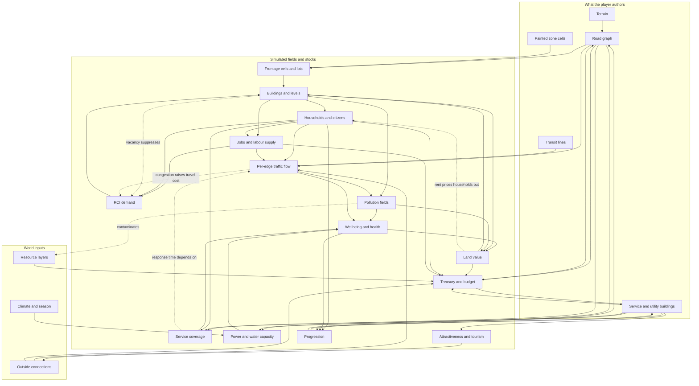

# Cities: Skylines II — Master Overview for Metropolis

This is the index and the argument. Twenty research documents in this folder describe how
*Cities: Skylines II* works, system by system; four documents one level up
(`zoning-growth.md`, `simulation.md`, `traffic.md`, `roads.md`) describe what Metropolis is
actually going to build. This file connects them: what exists, what feeds what, what matters
most, what we build first, and where our plan knowingly walks away from the reference game.

Nothing here restates a source. Every system doc keeps its own confidence tags, its own
numbers, and its own citation list; this document only carries conclusions. Read it first,
then read the two or three docs it points you at.

**Binding constraints** (from `docs/UNKNOWNS.md`, all decided 2026-08-08): a city builder,
not an idle game; roads and zone painting in the first five minutes on an empty map;
statistical per-edge traffic with decorative vehicles, no per-agent pathfinding in v1;
straight road segments before curves; roughly one to two thousand buildings at 60 fps via
instancing; CS2's interface *structure* mirrored closely with entirely original art, icons,
type, and copy.

---

## 1. System inventory

### The CS2 research set

| Doc | Essence in one line |
| --- | --- |
| `zoning-districts.md` | Roads emit an 8 m cell grid along their frontage; the player paints those cells and buildings grow themselves into the free runs. |
| `demand-growth.md` | The three demand bars are a readout of a simulated market, not a dial the player turns, and vacancy is the brake that stops overzoning from working. |
| `citizens.md` | Households, not individuals, are the acting unit; citizens are the texture that makes a household's decisions legible and followable. |
| `economy.md` | Money circulates between treasury, households, and firms rather than being scored, and player spending is the faucet that refills the private economy. |
| `traffic-pathfinding.md` | Every trip is a cost minimization over time, comfort, money, and rule-breaking, and even CS2 fakes a large share of the vehicles. |
| `roads-advanced.md` | One continuous elevation control produces cuts, tunnels, embankments, and bridges, and replace-in-place is what makes a city feel non-disposable. |
| `services-utilities.md` | Roads carry power and pipes for free, so the game is about capacity and placement — and electricity is a flow on a graph, which is where the bottleneck moment comes from. |
| `services-social.md` | Service coverage travels down streets as a budget consumed by the population it passes, and downstream storage capacity gates upstream collection. |
| `transit.md` | One authoring loop for every mode — depot, stops, network, line — and ridership is earned against the same path cost that decides driving. |
| `outside-connections.md` | The map edge is a set of typed spawners that supply workers, tourists, goods, and indifferent through traffic, with trade priced by volume rather than chosen. |
| `progression.md` | An experience currency buys milestones; milestones pay money, points, and permits at once; points buy branches of per-service trees the player picks. |
| `environment.md` | Four pollution fields with different transports and different victims, feeding a diffusing land-value field that is the reward channel for everything good you build. |
| `specialized-industry-areas.md` | The map has an opinion: extraction is place-then-draw over authored resource rasters, and depletion is a slow fade rather than a cliff. |
| `tourism-and-attractiveness.md` | One global attractiveness number does double duty — it sets arrivals and it steers the visitors already inside. |
| `terraforming-and-landscaping.md` | Four brushes, free and unmetered, with sample-a-height as the best ergonomic idea in the toolset and no undo as the worst omission. |
| `disasters-and-emergency-response.md` | Hazards are a capacity shock plus a liquidity test; the player's whole agency is spent before impact, buying coverage and warning time. |
| `ux-conventions.md` | A corner-anchored HUD over an unobstructed world, one taxonomy shared by toolbar, info views, and budget, and every number decomposing on hover. |
| `audio-and-radio.md` | Sound is a second notification channel: typed clips keyed to simulation conditions, plus camera-attached ambience and pooled, culled emitters. |
| `save-lifecycle-and-autosave.md` | The save is the whole simulation state, metadata is split from payload so the load screen is cheap, and every catalogued failure is a lifecycle bug rather than a simulation bug. |
| `simulation-architecture-and-performance.md` | Struct-of-arrays entities on a declarative phase schedule, with per-system intervals — and a simulation rate wrongly chained to frame rate, which is the mistake to not repeat. |

### The Metropolis implementation set

| Doc | Essence in one line |
| --- | --- |
| `../simulation.md` | Tick, day, and month cadence buckets; derived population; a three-scalar smoothed demand model; one ledger funnel; a failure-soft broke state. |
| `../zoning-growth.md` | Typed-array cell grid derived from road frontage, drag painting, lots found on demand, a budgeted growth tick, and procedural instanced low-poly buildings. |
| `../traffic.md` | A dense per-edge topology with a diffusion assignment producing one flow number per edge, a BPR speed curve, and an instanced vehicle pool that reads it. |
| `../roads.md` | The broad CS2 road survey — classes, snapping, elevation, utilities in roads, outside connections, the node/segment/lane data model. |

---

## 2. What feeds what

The graph below is the causal skeleton the whole game hangs on. Read it as "the arrow's
source is an input to the arrow's target." Solid arrows are the load-bearing couplings;
dotted arrows are the feedback edges that make the city a system rather than a pipeline.

Four readings worth pulling out of it:

- **Roads are upstream of nearly everything.** They generate the cells that permit zoning,
  they carry the utilities, they are the medium service coverage travels along, they are the
  network traffic loads onto, and they are the second largest ongoing cost. No other system
  has that reach. This is why the road milestone comes first and why road tooling quality is
  disproportionately worth paying for.
- **Land value is the convergence point.** Coverage, utilities, pollution, and building level
  all resolve into one spatial field, and that field then sets rent, taxes, and what grows
  next. It is the single densest node in the graph and therefore the single easiest place to
  create a runaway — which is exactly what happened to CS2 at launch.
- **The three feedback edges are the whole game.** Vacancy suppressing demand, congestion
  raising the cost of everything, and prosperity pricing out its own residents. Remove them
  and you get a growth curve; keep them and you get a city that argues back.
- **The outside connection is both a source and a sink.** It supplies goods, workers, and
  visitors, and it absorbs surplus. It is what keeps the demand loop from deadlocking on day
  one, and it is also the first thing that jams.

---

## 3. The ten things that make CS2 feel like CS2

Ranked by how much of the experience collapses if you remove them. Each names the doc that
covers it.

1. **Roads are the authoring surface; zoning is paint.** You never place a house. You draw a
   street, cells appear beside it, you drag a colour over them, and the city fills itself in.
   Every other pleasure in the genre is downstream of this indirection. — `zoning-districts.md`
2. **Demand is a symptom, not a faucet.** The bars answer "would something be viable here?"
   and the reason they sit where they do is always somewhere else in the city. Vacancy
   crushing demand the instant you overpaint is the specific mechanic that teaches this. —
   `demand-growth.md`
3. **Coverage flows down streets and is consumed by the people it passes.**
   Watching a service building light the road network green and then watching the green run
   out three blocks in because the towers are dense is a sensation no radius circle can
   produce, and it makes "where do I put the school" a decision that keeps changing as the
   city grows. — `services-social.md`
4. **Land value is spatial, diffusing, and the reward channel for everything good.** Services
   satisfy needs, needs raise wellbeing, wellbeing raises willingness to pay, and that raises
   value which spreads to neighbours. It is why CS2 cities develop legibly good and bad
   districts instead of uniform sprawl. — `environment.md`, `demand-growth.md`
5. **Traffic responds to what you built, with lag, and does not forgive.** Routes are chosen
   by a cost the player can manipulate; a change takes a beat to propagate; and without a
   despawn valve, bad geometry stays bad. Consequence with momentum is the genre's tension. —
   `traffic-pathfinding.md`
6. **One taxonomy everywhere, over an unobstructed world.** The same dozen service names label
   the toolbar, the info views, and the budget lines; info views recolour the city instead of
   replacing it; every number decomposes on hover; problems announce themselves as icons on
   the offending building. — `ux-conventions.md`
7. **Continuous elevation, and replace-in-place.** One signed number turns into trenches,
   tunnels, embankments, and bridges without a mode switch; and upgrading a spine road from
   two lanes to four without losing the buildings beside it is the moment a city stops feeling
   disposable. — `roads-advanced.md`
8. **Utilities are free to connect and hard to size.** Because roads carry power and pipes,
   the player never wires anything — they think about capacity and placement, and the
   signature failure is a lit city with a dark district because everything funnels through one
   edge. — `services-utilities.md`
9. **Progression as a schedule of chapters you partly choose.** A bar that moves while you
   play, milestones that land as events paying several currencies at once, and a point
   currency the player spends on their own priorities. Content arrives roughly when it becomes
   a problem, so gating reads as responsiveness. — `progression.md`
10. **Named individuals you can follow.** Click one dot, learn a name and a job, watch them
    graduate and move house. It changes no simulation state and carries most of the emotional
    payload — and it is nearly free once state is per-citizen and event-driven. —
    `citizens.md`

Just below the line, and worth naming because they are cheap: the emergent, distance-priced
trade that makes the map edge feel like a region (`outside-connections.md`); sound as a second
notification channel (`audio-and-radio.md`); and the load screen as a shelf of places rather
than a list of files (`save-lifecycle-and-autosave.md`).

**Three things CS2 does that we should deliberately not copy.** The education trap, where
schooling your city into a labour shortage makes under-educating a district the correct play
(`citizens.md`). The land-value death spiral, driven by what the richest renter was *willing*
to pay over an absurdly long diffusion range (`demand-growth.md`, `environment.md`). And
progression experience awarded for the *act* of placing a building rather than for a building
standing, which made place-and-delete an exploit (`progression.md`).

---

## 4. Metropolis adoption roadmap

Tiers: **v1** is the milestone set already committed in `docs/ORCHESTRATION.md` through the
first playable city. **v1.5** is the next horizon — the systems that make the city argue back.
**v2** is the deep simulation that presupposes agents. **Out of scope** means not planned, for
stated reasons, though most of these leave a reserved field behind.

Every row is consistent with `docs/UNKNOWNS.md`: statistical traffic, straight roads first,
zoning and growth as the opening loop, CS2-patterned interface with original art.

### v1 — now

| System | Doc | What ships | Why now |
| --- | --- | --- | --- |
| Road graph and straight-segment tool | `roads-advanced.md`, `../roads.md` | Nodes and edges on the 8 m grid, two classes, costed preview, continuous chaining, grid mode, three snap toggles, replace-in-place class swap | Everything else in the graph hangs off the road network, and the decided first five minutes begin with drawing one. |
| Zone cell grid and drag painting | `zoning-districts.md`, `../zoning-growth.md` | Cells derived from frontage, four zone paints, drag stroke with interpolation, per-cell fee, cells owned by their road | This is the authoring surface and rank 1 of the feel list; nothing about it needs any other system to exist. |
| Lot formation and building growth | `zoning-districts.md`, `../zoning-growth.md` | Lots found on demand, budgeted growth tick, procedural low-poly instanced buildings, demolition of stranded lots | The payoff half of the opening loop — the moment the city starts filling itself in. |
| RCI demand with a vacancy brake | `demand-growth.md`, `../simulation.md` | Three smoothed scalars, seeded bootstrap floor, citywide vacancy suppressing residential | Rank 2 of the feel list, and the vacancy term is one line over aggregates we already compute. |
| Statistical traffic flow and visual vehicles | `traffic-pathfinding.md`, `../traffic.md` | Dense edge topology, diffusion assignment, BPR congestion curve, pooled instanced vehicles, congestion tint | Directly decided in UNKNOWNS, and it is the mitigation for the exact cost that capped CS2's cities. |
| Treasury, tax, upkeep, broke state | `economy.md`, `../simulation.md` | One ledger funnel, monthly settlement, two budget lines, soft brake instead of game over | A build tool without a price is not a decision; the ledger is also the seam every later economic system plugs into. |
| Corner-anchored HUD and toolbar | `ux-conventions.md` | Clock cluster, treasury and demand cluster, two-level toolbar, tool options panel, tooltip discipline, notification markers, selection inspector | The UI decision in UNKNOWNS is explicitly about structure, and the structure is what makes a genre player instantly fluent. |
| Info views as a world mode | `ux-conventions.md` | Zones, traffic, demand, plus a reserved slot per future field | Info views are how every later field earns its legibility; building the mode now means later systems cost only their data. |
| Fixed-timestep simulation with phase buckets | `simulation-architecture-and-performance.md`, `../simulation.md` | Tick, daily, and monthly cadences derived from tick index; deterministic seeded RNG; struct-of-arrays entities | This is architecture, not a feature — retrofitting it after fifty systems exist is a rewrite. See §6. |
| Save, autosave, and versioned migration | `save-lifecycle-and-autosave.md` | Metadata split from payload, continue pointer with a safe fallback, write-then-swap, autosave on by default, schema version chain, export to file | Every catalogued CS2 save failure is cheap to prevent now and expensive to retrofit; losing a city is the one bug players do not forgive. |
| Outside connection, thin | `outside-connections.md`, `../traffic.md` | One map-authored road connection supplying constant emit and attract on boundary edges | Already in the traffic brief; it is what stops all flow from being internal and makes the border road jam the way players expect. |
| Progression bar, thin | `progression.md`, `ux-conventions.md` | Roughly five thresholds revealing toolbar categories on a schedule | The panel is part of the mirrored UI structure, and gated reveal is the only onboarding the opening needs. |
| UI sound grammar | `audio-and-radio.md` | Distinct, rate-limited, pitch-varied cues for valid hover, place, reject, bulldoze, drag start and end, panel, milestone | Procedurally synthesized in WebAudio, so it costs no download weight, and tool feedback is where sound does the most work per byte. |

### v1.5 — next

| System | Doc | What ships | Why then |
| --- | --- | --- | --- |
| Land value as a diffusing field | `environment.md`, `demand-growth.md` | One float array, short-range diffusion, capped, seeded by amenities and services and dragged down by blight, with its own info view | The densest node in the dependency graph; it needs services to have something to be seeded by, and it makes level-ups and abandonment legible. |
| Building levels 1 to 5 | `demand-growth.md`, `zoning-districts.md` | Prosperity accumulator, linear upkeep growth, capacity curve, level-down as well as level-up | Largest gain in "the city is alive" per unit of work, but it needs land value underneath it to mean anything. |
| Abandonment, blight, condemnation | `demand-growth.md` | Hysteresis before abandonment, negative land-value contribution, bulldoze to clear, condemnation named separately from economic abandonment | This is the negative feedback that keeps a diffusing value field from diverging; ship it in the same milestone as the field. |
| Power and water | `services-utilities.md` | Roads carry both implicitly, electricity as a capacitated flow over the road graph with a transformer cure, water as capacity with shortfall allocated by network distance | Feel rank 8, and the electricity bottleneck moment is the one piece of utility fidelity genuinely worth paying for. |
| Social service coverage | `services-social.md` | Network-propagated flood consumed by population along the way, per-service info views recolouring roads, budget sliders, garbage as the one service with real dynamics | Feel rank 3, and it is cheap once the road graph exists — a Dijkstra with a budget instead of a distance limit. |
| Wellbeing and health as two channels | `services-social.md`, `environment.md`, `citizens.md` | Coverage and utilities and pollution resolving into two scalars per building, feeding land value only through willingness to pay | Keeping services out of land value directly is the indirection that stops "spam every service" from being a strategy; retrofitting it later means rebalancing everything. |
| Pollution fields | `environment.md` | Air, ground, water, noise on a coarse raster, advection as a directional bias in the diffusion kernel, wind and flow arrows drawn in the overlay, ground pollution with memory | Four channels for barely more than one, and the two-ramp info view is the highest value-per-line borrowing in the whole set. |
| Districts, paint and name plus two policies | `zoning-districts.md` | Free-form painted areas with a name, a colour, one statistic, a narrow tax modifier, and a heavy-traffic multiplier on freight flow | Feel rank below the top ten but the identity payload is large, and both policies fit the statistical flow model as cost multipliers. |
| Milestones, points, and small trees | `progression.md` | Roughly eight milestones, dual passive and active experience, four trees with doubling tier costs, tier one free, branching without tier-clearing | Feel rank 9; it needs enough systems to exist that a tree can mirror them honestly rather than promise things. |
| Terraforming | `terraforming-and-landscaping.md` | Mutable chunk-dirtying heightfield, shift and level and soften, radial falloff, free and unmetered, occupancy masking against roads, and undo from day one | Blocked on nothing but the heightfield being writable, and it unblocks road cut-and-fill later. |
| Road elevation and bridges | `roads-advanced.md` | Per-node elevation offset nudged while drawing, grade checked against the road profile, piers above a clearance threshold | Feel rank 7 and the doc's one non-obvious recommendation: if only one geometric extension ships, it should be vertical rather than horizontal. |
| Day, night, and season as multipliers | `environment.md` | Day equals month, year equals twelve days, a temperature scalar driving power draw both directions, night thinning traffic | Weather as multipliers on curves that already exist is the cheapest possible depth in the entire set. |
| Ambient audio bed and emitters | `audio-and-radio.md` | Camera-attached beds selected by what is underneath, pooled and culled building emitters, road noise driven by per-edge flow — fed by the same numbers as the noise field | Waits for the noise field to exist, then gets the coupling CS2 never made, for almost nothing. |
| Fire hazard as a coverage derivative | `disasters-and-emergency-response.md` | One scalar per building derived from fire coverage, plus its info view; a damage field that nothing writes yet | Prevention-as-coverage is the signature feel, and the damage field is the hook every future hazard propagates through. |
| Attractiveness reserved | `tourism-and-attractiveness.md` | A field on the building definition and a city-level sum, kept separate from leisure, displayed nowhere | One number in a table now versus a data migration later; showing it before tourists exist would be worse than hiding it. |

### v2 — later

| System | Doc | Why it waits |
| --- | --- | --- |
| Households and citizens as records | `citizens.md` | The whole lifepath payload — names, ages, education ladder, the move ladder, stage-weighted needs — presupposes replacing the occupancy scalar, which every aggregate currently consumes. Do it once, deliberately, after the aggregate model has proven its couplings. |
| Per-agent pathfinding and trip state | `traffic-pathfinding.md` | Explicitly deferred in UNKNOWNS, and it is the single cost that capped CS2's cities. Only worth attempting behind a hard query budget with a visible queue depth. |
| Rent as a quantity distinct from land value | `economy.md`, `demand-growth.md` | This split is precisely where the death spiral lives. It needs households to exist so affordability can be checked against what occupants can pay rather than what the richest would pay. |
| Circular money flow with redistribution | `economy.md` | The faucet-and-sink model needs firms and households holding their own balances; until then the treasury ledger is honest and sufficient. |
| Public transit | `transit.md` | Needs the depot-stops-network-line loop plus a logit mode split over origin-destination pairs the flow model does not yet expose. Bus and metro first, transfers immediately after — transfers are what turns lines into a system. |
| Full outside connections | `outside-connections.md` | Rail and player-created connections, per-mode trade efficiency, commuters, through-traffic distribution weighted by capacity. Depends on a real trade model. |
| Tourism | `tourism-and-attractiveness.md` | Statistical from the start, never per-tourist before per-citizen. Needs attractiveness surfaced, outside connections, and a lodging demand channel that is visible rather than buried inside commercial demand. |
| Resource graph and specialized industry | `specialized-industry-areas.md`, `economy.md` | Extraction is meaningless before a production chain exists to feed. Reserve the coarse resource raster and the worked-area concept now; build nothing. |
| Real disasters | `disasters-and-emergency-response.md` | Building fires first, statistically, once damage and repair economics exist. Wildfire needs vegetation as a simulated fuel raster; shelters need citizen agents to move. |
| Radio with typed condition-keyed clips | `audio-and-radio.md` | The scheduler is the valuable part and it is a data model, but it wants enough simulated conditions to key against — and a text ticker proves the shape before any voice work. |
| Curved roads | `roads-advanced.md`, `../roads.md` | Promoting the centreline to a Bezier reparameterizes length, terrain probing, zone strip generation, and vehicle positions. The largest single refactor on the road path; do it once or not at all. |
| Photo mode, social feed, development-tree depth | `ux-conventions.md` | Texture on a working game. The feed in particular should subscribe to the same event stream as notification markers, with an editorial voice and a hard opt-out. |

### Out of scope

| System | Doc | Why not |
| --- | --- | --- |
| Real water simulation | `environment.md`, `simulation-architecture-and-performance.md` | A fluid solver is the largest cost in the reference game's environment budget and it earned its own decoupled clock there. In a single-threaded browser it is not a tradeoff, it is a refusal. Water stays static geometry with a per-body flow direction. |
| Lane-level graph and car-following | `traffic-pathfinding.md` | Downstream of per-agent pathfinding, and the layer where all of CS2's performance went. Even the reference game ships a culling coefficient that fakes most of it. |
| Architectural themes and a second building catalogue | `zoning-districts.md`, `progression.md` | Purely an art-pipeline question, and our art direction is one original low-poly catalogue. |
| The thirty-six resource inventory | `economy.md` | Two abstractions carry the loop. A resource graph of eight to twelve is the v2 ambition; thirty-six is content, not mechanism. |
| Voiced radio hosts | `audio-and-radio.md` | Voice acting is out of budget for an open-source build. The scheduler renders to a text ticker instead, and voice drops in later without a rewrite. |
| Cloud sync and delta saves | `save-lifecycle-and-autosave.md` | Full snapshots are fine at our state size, and incremental saving is where corruption bugs live. |
| Map editor and heightmap interchange | `terraforming-and-landscaping.md` | Only sensible as a permission-widened view of the in-game tools, which means it is strictly downstream of those tools being good. |
| Anything reproducing CS2's assets, names, icons, fonts, copy, or audio | all | Binding project constraint. Mechanics and numeric parameters are recreated from public description; expression is original throughout. |

---

## 5. Where our plan aligns with CS2, and where it does not

### Aligned, deliberately

- **One grid.** The 8 m zone cell equals the road snap increment equals — by a happy accident
  recorded in `terraforming-and-landscaping.md` — the terrain heightfield spacing. CS2 shares
  the first two; we share all three. No second alignment system anywhere.
- **Cells are owned by their road.** Delete the segment, the cells go, anything standing on
  them is demolished. Our frontage rebuild derives this from a full recompute rather than
  incremental bookkeeping, which is slower and correct.
- **Demand as a smoothed readout with a vacancy brake.** The couplings in `../simulation.md`
  already match CS2's directional logic; adding vacancy suppression makes the bars behave like
  the reference game's for the cost of one clamp.
- **Difference-only pricing on upgrades, stingy refunds on demolition.** Both post-Economy-2.0
  behaviours, both already in the road brief, both cheap and both good.
- **Info views as a mode over the world, and every number decomposing on hover.** Structural,
  and the reason our later fields cost only their data.
- **Struct-of-arrays with per-system tick intervals and shared immutable definitions indexed
  by type.** CS2's data and scheduling model, minus the parallelism we cannot have.

### Divergent, and it matters to feel

These are the places where our plan produces a different *sensation*, not merely a different
implementation. Each is a decision the owner could reverse.

1. **Traffic is a field, not a population.** CS2's jams emerge from local capacity violations
   between individual drivers; ours emerge from a volume-to-capacity curve on an edge. The
   observable difference is not the red road — it is that our congestion cannot deadlock and
   therefore cannot punish. `../traffic.md` names the fix and it is the right one: make the
   BPR curve steep enough that an over-capacity edge becomes visibly, punitively slow and
   stays that way. A gentle curve makes the whole system feel weightless. **This is the single
   most important tuning decision in v1.**
2. **The last hundred metres are missing.** Parking, walking legs, and the gap between a
   destination being *reachable* and being *accessible* is the most distinctive traffic idea
   in the reference game, and it is the one our model cannot express directly.
   `traffic-pathfinding.md` proposes recovering most of it as a destination-arrival cost
   penalty derived from local parking supply. Worth doing in v1.5; without it, dense downtowns
   feel too easy.
3. **No individuals to follow.** Rank 10 of the feel list is absent for the whole of v1,
   because population is derived from housing rather than being a list of people. This is a
   genuine loss of emotional payload and the honest mitigation is not to fake it — a fake name
   attached to a statistical fraction is worse than no name. It returns properly with
   households in v2.
4. **Service coverage arrives late.** In CS2, coverage flooding down streets is visible from
   the first fire station. In our plan the first playable city has no services at all, so the
   opening is zoning-and-growth only. This is correct sequencing but it means the v1 build is
   thinner than the reference game's first ten minutes, and playtesting should expect that.
5. **Elevation before curvature.** CS2's road tool gives you both from the start;
   `roads-advanced.md` argues that if we can only ship one, vertical beats horizontal, because
   bridges and cuts carry more of the feel than curves do and curves actively waste zone
   frontage. This is a real divergence in *look* — our early cities will be more rectilinear
   than a CS2 city — and it is a deliberate trade.
6. **Undo exists.** CS2 shipped terraforming with no history and players terraform timidly as
   a result. We add a stroke ring buffer from the first commit. This is the first place we
   knowingly overrule the reference game on an interaction, and the justification is that
   nobody defends the absence.
7. **Autosave defaults on.** CS2's off-by-default was a performance concession at their state
   size. Ours is small enough that the concession is unnecessary, and the cost of copying it
   is measured in lost cities.
8. **Over-qualified workers get hired.** When education arrives, it will not carry CS2's
   hiring-rate penalty. The education trap is coherent with its own rules and it punishes the
   player for doing the obviously good thing; we keep the pipeline and drop the inversion.
9. **Land value never feeds its own seed.** Seeds come from amenities and services only,
   diffusion range is short, and the field is capped. Three constraints chosen specifically
   from the post-mortem of the launch runaway.
10. **Progression experience is awarded for buildings that stand, and revoked on demolition.**
    One field on the building record kills the place-and-delete exploit outright.

### Divergent, and it does not matter much

Worth recording so nobody re-litigates them: four zone types instead of fourteen; zone depth
of four cells rather than six; two utility resources instead of the full network; three
education tiers rather than five when education lands; eight milestones rather than twenty;
two transit modes rather than seven; three or four handcrafted maps rather than ten. Every one
of these is content volume on top of an identical mechanic, and every one is a data-table edit
to widen later.

---

## 6. Engineering guardrails

Distilled from `simulation-architecture-and-performance.md`, restated for a single-threaded
browser. These are not optimizations to consider — they are the shape of the code.

1. **Never step the simulation once per animation frame.** Accumulate real elapsed time,
   step a fixed tick, interpolate visuals between the last two states. The reference game
   chained its sim rate to its frame rate and a slow machine plays a different game.
2. **Cap catch-up.** Run at most three or four ticks in one frame; drop the surplus and let
   the in-game clock fall behind wall clock. A frame that owes more ticks than the last one is
   a death spiral, and the fix is one conditional.
3. **A tick is a tick.** No simulation quantity is ever scaled by frame delta. Rates are
   per-tick constants. This buys determinism and replayability for free, and it is what makes
   the save round-trip test meaningful.
4. **Entities are indices into typed arrays, never objects in a map.** Objects-in-a-map means
   a heap allocation per entity, a pointer chase per iteration, and a garbage pause at
   precisely the moment the city gets interesting.
5. **Allocate nothing inside the tick loop.** No array or object literals, no closures, no
   map or filter chains over entity arrays. Preallocate scratch buffers and reuse them.
6. **Systems never call systems.** One explicit ordered list of records with a declared phase
   and a tick interval, iterated in order. Emergent ordering produces cycles and makes
   per-system cost unmeasurable because the cost is nested.
7. **Every system declares how often it runs.** Vehicle interpolation every tick; demand every
   day; land value and budget monthly. Build the interval mechanism before the systems, not
   after — it is the highest-leverage performance tool available in a single thread.
8. **Amortize whole-city passes over frames.** A system that must touch every building
   processes a rotating slice per tick rather than the whole array on a schedule. Constant
   cost beats a periodic spike, because a spike is what the player perceives as a stutter.
9. **Grid solvers get their own coarser cadence and their own resolution.** Pollution, land
   value, and any diffusion run on a raster much coarser than the zone cell, on a slow
   interval, double-buffered so the pass is order-independent and deterministic. Expose one
   speed control to the player; internal cadences are never a setting.
10. **Never recompute a whole-city aggregate to satisfy the UI.** Demand, population, budget,
    totals: computed once per aggregate tick, cached, read. A hover must never trigger a pass.
11. **One instanced draw call per building type, and distance simplification from the start.**
    Low-poly is the level-of-detail strategy, not just the art direction. Beyond a radius,
    buildings become boxes and vehicles stop drawing. Adding this later is expensive and in
    the reference game it never fully happened.
12. **No expensive post-processing.** No depth of field, no volumetrics, no screen-space
    global illumination. A top-down camera cannot show them off and the reference game
    demonstrated exactly what they cost.
13. **Cull aggressively on the CPU and update the instance buffer only when the visible set
    changes.** The reference game shipped with frustum culling only; we should not ship with
    less, and a dense downtown is exactly where occlusion would pay.
14. **Serialize through an explicit versioned format, never the array layout.** Struct-of-
    arrays is fast and brittle to schema change; a migration chain from version *n* to *n+1*
    is trivial to add now and impossible to retrofit once saves exist in the wild.
15. **Snapshot between ticks, never during one.** Saving takes the world as a frozen input. If
    that stalls visibly, the next step is clone-and-hand-off to a worker, never save-while-it-
    mutates.
16. **Ship the per-system profiler overlay in milestone one.** Per-system tick cost in
    milliseconds, sim and render tick counts, entity counts. The reference game's launch story
    is a story about nobody knowing where the time went until strangers decompiled the game.
17. **Hold the line on per-agent pathfinding.** It is the specific cost that capped CS2's
    cities, and statistical flow on a graph of a few thousand edges is a bounded per-tick cost
    that does not grow with population. If it ever arrives, it arrives behind a hard query
    budget with the queue depth visible in the UI — an instrument rather than a surprise.

---

## 7. Reading order for a new contributor

- **Building the opening loop:** `zoning-districts.md`, then `../zoning-growth.md`,
  then `demand-growth.md`.
- **Building anything that moves:** `traffic-pathfinding.md`, then `../traffic.md`.
- **Building anything at all:** `simulation-architecture-and-performance.md` and
  `../simulation.md`, before writing a system.
- **Building interface:** `ux-conventions.md`, and nothing else, until it is internalized.
- **Building the second horizon:** `services-social.md` and `environment.md` together — they
  are one loop described from two ends.
